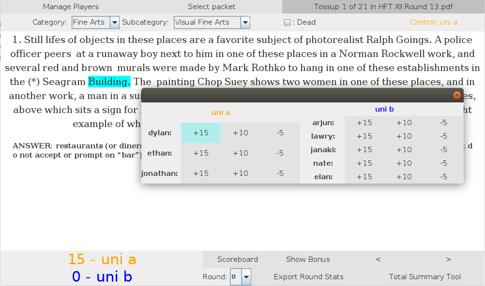
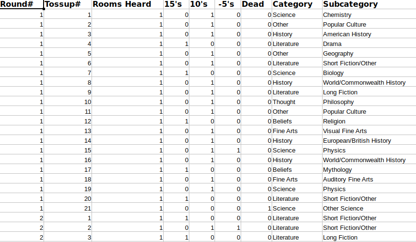

## Simple GUI to read packets while marking buzzes and bonuses

## Easily generate round by round stats in human readable Excel files
- Buzzpoints in cDepth
- Powers/Tossups/Negs
- Category/Subcategory
- Points per Bonus
- Points per Tossup Heard

### Spreadsheet of buzzes during the round

### Spreadsheet of bonuses heard

## Comprehensive tournament stats compilation
- Every recorded buzz from every round
- Teams and Players ranked by *every* category
	- Which team had the highest PPB in Literature?
	- What about American Lit?
- Tossup and Bonus converion rates on every question
	- How many rooms bageled bonus 6 from Round 1?
	- How many rooms went dead on tossup 10 from Round 4?
	- What percentage of Myth tossups were powered?
	- What percentage of Sports bonuses were bageled?

### Conversion spreadsheet

### Ranking spreadsheet

### Spreadsheet of all buzzes
